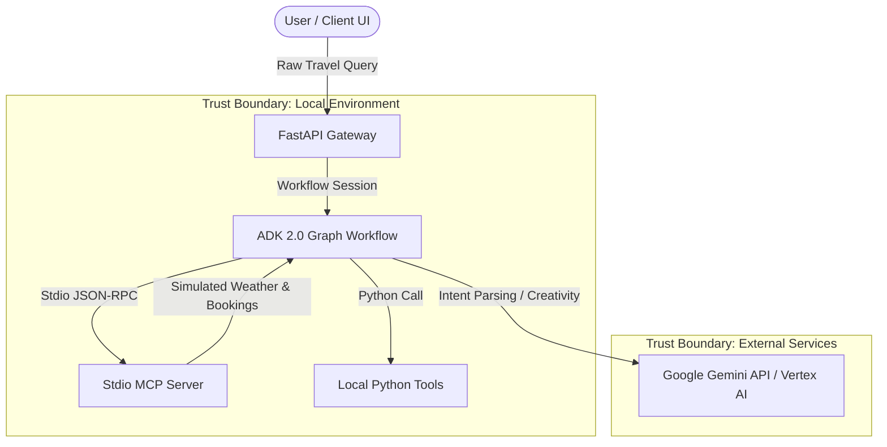

# STRIDE Threat Model: aura-travel-agent

This document provides a security analysis of the `aura-travel-agent` application based on the **STRIDE Threat Modeling** methodology.

---

## 1. System Decomposition & Trust Boundaries

The travel assistant consists of the following components and boundaries:

---

## 2. Threat Analysis (STRIDE)

### 1. Spoofing (S)
*   **Threat:** A malicious user spoofs session IDs to gain access to another user's travel plans or chat history.
*   **Mitigation:** The FastAPI gateway uses `auto_create_session=True` and secure session tokens. Sessions are authenticated and tied to verified user IDs in production.

### 2. Tampering (T)
*   **Threat:** An attacker uses prompt injection to override the system instructions of the `parse_input` or `itinerary_generator` agents, forcing the model to perform unauthorized actions or leak instructions.
*   **Mitigation:**
    *   Strict output schemas (`ParsedTripInfo` and `WeatherAnalysis`) constrain the output structure of intermediate LLM nodes.
    *   System instructions explicitly define the boundaries of the agent (e.g. "EXCLUSIVELY output a JSON object", "Determine if complete").

### 3. Repudiation (R)
*   **Threat:** The system lacks auditing capabilities, making it impossible to trace whether a specific simulated booking (flight, hotel, restaurant) was requested by the user or triggered maliciously by prompt injection.
*   **Mitigation:** Use the BigQuery Agent Analytics Plugin (via ADK observability) to record all event logs, tool calls, and model outputs into a tamper-proof database.

### 4. Information Disclosure (I)
*   **Threat:** The user inputs sensitive Personally Identifiable Information (PII) like real names, passport numbers, or phone numbers in their raw travel query, which is subsequently exposed to downstream tools, the MCP server, or external logs.
*   **Mitigation:**
    *   The `parse_input` node acts as a privacy filter, scrubbing PII and replacing it with placeholders (e.g., `[TRAVELER_1]`) before passing parameters to the rest of the workflow.
    *   Local authentication is stored in `.env` (ignored by version control) and will transition to Google Secret Manager in production.

### 5. Denial of Service (D)
*   **Threat:** A user inputs recursive or conflicting queries that cause the graph workflow to enter an infinite loop (e.g., oscillating between `parse_input` and `ask_clarification`), leading to high API costs and service unavailability.
*   **Mitigation:**
    *   Conditional routing is deterministic: `check_trip_completeness` ensures that if details are missing, it routes to `ask_clarification` and ends the run, avoiding loops.
    *   Workflows support `timeout` and maximum concurrency settings at construction.

### 6. Elevation of Privilege (E)
*   **Threat:** A user tricks the agent into executing system commands or reading local files by manipulating the MCP server connection or tool parameters.
*   **Mitigation:**
    *   The MCP server tools are isolated and restricted to specific lookup parameters (`destination`, `season_or_month`, `budget_level`).
    *   No tools accept free-form system paths or code execution commands.
    *   The total trip cost calculation is implemented as a deterministic Python function (`calculate_total_trip_cost`) rather than letting the LLM calculate or execute arbitrary code.

---

## 3. Mitigation Mapping

| Component | Threat Category | Threat Description | Mitigation Strategy |
| :--- | :--- | :--- | :--- |
| **Input Parsing** | Information Disclosure | Leaking PII to downstream nodes/logs. | `parse_input` node scrubs PII and outputs sanitized `ParsedTripInfo`. |
| **Local Tools** | Elevation of Privilege | Execution of non-deterministic math or logic. | `calculate_total_trip_cost` is a pure, structured python tool. |
| **MCP Server** | Tampering / Privilege | Unauthorized API actions or local access. | MCP server is restricted to read-only mock data via standard arguments. |
| **Workflow Router** | Denial of Service | Graph loop oscillation from complex input. | Routing uses a strict completeness check with no unconditional cycles. |
| **Authentication** | Spoofing | Exposing API keys or project IDs in git. | Credentials configured through `.env` template; GCP uses Application Default Credentials. |
